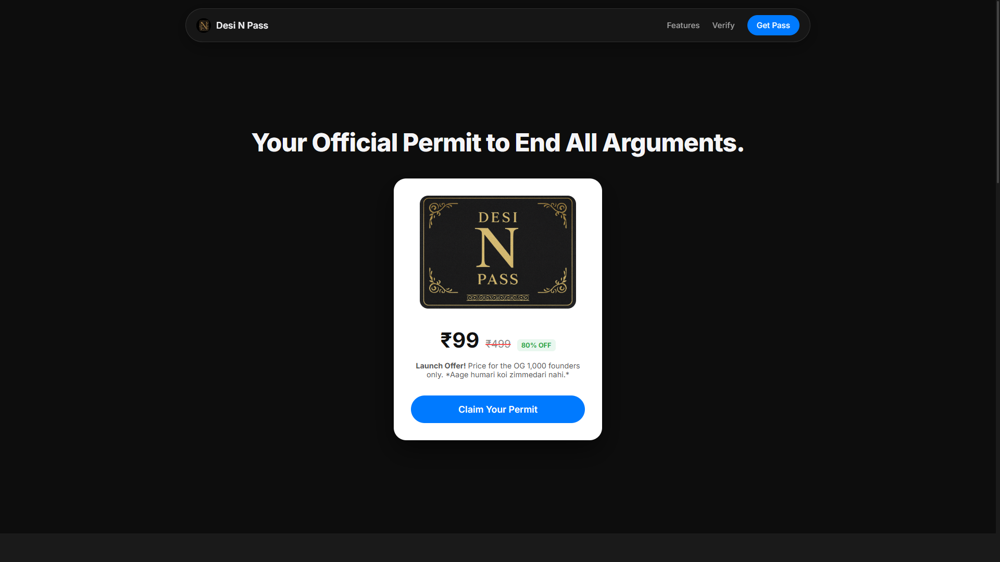

# Desi N Pass - Digital Collectible E-commerce Store

### ➡️ [View Live Demo](https://abhisheksinghshekhawatsde.github.io/Desi-N-Pass/) ⬅️

This repository contains the complete frontend source code for the **Desi N Pass** e-commerce website. It's a lightweight, serverless, single-product digital store designed to be fast, secure, and easy to deploy.

The project allows users to land on a polished product page, purchase a personalized digital "pass," and pay securely online. The order details are then captured in a Google Sheet backend for manual fulfillment.

## 🚀 Core Features

- **Polished Frontend:** A fully responsive, multi-section landing page built with modern HTML5 and CSS3.
- **Product Showcase:** Includes a hero section, feature highlights, and a PDP-style section with an image carousel.
- **Dedicated Checkout Flow:** A secure, multi-page checkout process to capture user details and handle payments.
- **Online Payments:** Integrated with **Razorpay** to accept Cards, UPI, Netbanking, and Wallets.
- **Serverless Backend:** Uses **Google Sheets** as a database and **Google Apps Script** as a secure API endpoint to log orders.
- **Fraud Prevention:** Implements a client-side **HMAC-SHA256 token** system to verify the authenticity of each order against the Razorpay transaction.
- **SEO & Social Optimized:** Includes a full suite of meta tags, Open Graph tags, Twitter cards, and JSON-LD schema for rich search results.
- **Legal Compliance:** Comes with pre-built, professional templates for Terms of Service, Privacy Policy, Shipping, and Refund pages.

## 🛠️ Tech Stack

| Component               | Stack                 | Why?                                                                      |
| ----------------------- | --------------------- | ------------------------------------------------------------------------- |
| **Frontend**            | HTML / CSS / JS       | No frameworks for maximum speed, performance, and full control.           |
| **Backend/API**         | Google Apps Script    | Free, powerful enough for the logic, and integrates seamlessly with Sheets. |
| **Database**            | Google Sheets         | Free, easy to manage, and acts as a simple order management dashboard.    |
| **Payment Gateway**     | Razorpay              | Excellent documentation, easy integration, and robust support for India.  |
| **Security Hashing**    | CryptoJS              | Lightweight client-side library for generating the HMAC verification token. |
| **Hosting (Recommended)**| Cloudflare Pages / Netlify / Vercel | Free, offers global CDN for speed, and provides continuous deployment.     |

## ⚙️ System Flow

1.  **User Visits `index.html`**: Sees the product and marketing content.
2.  **Clicks "Buy Now"**: Fills out a name and email on the `#buy` section's form.
3.  **Redirect to Checkout**: The user is redirected to `checkout.html`, carrying the name and email via `sessionStorage`.
4.  **Payment Initiation**: `checkout.html` automatically triggers the Razorpay payment popup.
5.  **Payment Success**: Upon successful payment, Razorpay redirects the user back to `index.html` with success parameters in the URL (`?status=success&...`).
6.  **Backend Submission**: The `script.js` on `index.html` detects the success parameters, packages the order data (including the `paymentId` and `verificationToken`), and sends it to the Google Apps Script URL.
7.  **Order Recorded**: The Apps Script receives the data, generates a unique serial number, and appends a new row to the Google Sheet.
8.  **Fulfillment**: The store owner manually verifies the payment in the Razorpay dashboard using the `paymentId` and hashed token, then emails the personalized digital pass to the customer.

## 🚀 Getting Started (Setup Guide)

To get this project running, you need to configure three main parts: the frontend, the backend, and the payment gateway.

### 1. Backend Setup (Google Sheet & Apps Script)

1.  **Create a Google Sheet:** Name it "Desi N Pass Orders".
2.  **Set Headers:** In the first row, add these exact column headers:
    `Timestamp`, `Name`, `Email`, `PaymentID`, `SerialNumber`, `Status`, `VerificationToken`
3.  **Create Apps Script:** Go to `Extensions` > `Apps Script`. Delete any existing code and paste the contents of the final `Code.gs` script.
4.  **Deploy:** Click `Deploy` > `New deployment`.
    -   Select type: **Web app**.
    -   Execute as: **Me**.
    -   Who has access: **Anyone**.
5.  Authorize the permissions and **copy the generated Web app URL**.

### 2. Payment Gateway Setup (Razorpay)

1.  **Create a Razorpay Account:** Complete your KYC to accept payments.
2.  **Get API Keys:** In the Razorpay Dashboard, go to `Account & Settings` > `API Keys`.
3.  **Generate Keys:** Generate a new key for **Test Mode** first. Copy the **Key ID** (`rzp_test_...`).

### 3. Frontend Configuration (`script.js` & `checkout.html`)

1.  **Open `script.js`:**
    -   Replace `YOUR_GOOGLE_APPS_SCRIPT_WEB_APP_URL` with the URL you copied from your Apps Script deployment.
2.  **Open `checkout.html`:**
    -   Inside the `<script>` tag at the bottom, find the `CONFIG` object.
    -   Replace `rzp_test_...` with your **Razorpay Test Key ID**.
    -   Define a long, random, and unique `SECRET_KEY`. **Save this key somewhere safe!**
3.  **SEO Configuration (Optional but Recommended):**
    -   In `index.html`, replace all instances of `https://YOUR_FINAL_WEBSITE_URL.com/` with your actual domain once you have deployed the site.

### 4. Final Testing and Go-Live

1.  Perform an end-to-end test using Razorpay's Test Mode.
2.  Verify that the order appears correctly in your Google Sheet and Razorpay Dashboard.
3.  Once ready, switch Razorpay to **Live Mode**, generate a **Live Key ID**, and update it in `checkout.html`.
4.  Deploy your project folder to your chosen hosting provider.

---
**Author:** [Your Name/Handle]
